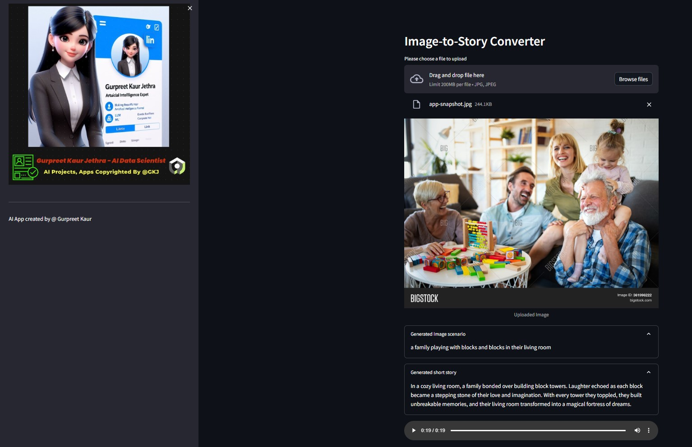

# 🖼️ VisionSpeakAI - Image-to-Speech GenAI 🎙️🔥  
AI-powered tool that **analyzes an image** and **converts it into a narrated short story** using **LLMs (Large Language Models)** and **AI-powered TTS (Text-to-Speech)**.  

🚀 **Powered by:** Hugging Face AI, OpenAI, LangChain, and Streamlit.  
🎯 **Use Cases:** Accessibility, storytelling, content generation, and AI-powered narration.

---

## 🌍 **Live Demo**  

🔹 **Run App with Streamlit Cloud**  
[🚀 Launch on Streamlit](https://image-to-speech-genai-tool-using-llm.streamlit.app/)

🔹 **Run App with Hugging Face Cloud**  
[🚀 Launch on HuggingFace Space](https://huggingface.co/spaces/GurpreetKJ/Image-to-SpeechStory_GenAI-Tool)

---

## 🎥 **How It Works (Demo)**
🖼️ Upload an image → 🤖 AI generates a **short story** → 🔊 AI **narrates the story**  

  

📌 **Example Output:**  
  

🎧 **Listen to the AI-generated narration** in the `img-audio` folder.

---

## 🏗 **How It Works (System Design)**  
  

### **🔄 AI Workflow**
1️⃣ **Image-to-Text** → AI extracts the meaning/context from the image.  
2️⃣ **Text-to-Story** → OpenAI's GPT-3.5 Turbo generates a **creative short story**.  
3️⃣ **Story-to-Speech** → AI converts the story into **natural-sounding speech**.  
4️⃣ **User Interaction** → Upload an image, listen to the generated story.

---

## ⚡ **Features**
✅ **AI-powered Image Understanding** (Hugging Face Transformer)  
✅ **Creative Story Generation** (GPT-3.5 Turbo)  
✅ **Human-like Speech Synthesis** (Hugging Face TTS)  
✅ **Multi-Language Support** (Customizable for different languages)  
✅ **Web-based UI with Streamlit**  

📌 Example:  
  

🎧 **Listen to the narrated story in `img-audio` folder.**

---

## 📌 **Tech Stack**
- **Hugging Face Transformers** (`Salesforce/blip-image-captioning-base`)
- **OpenAI GPT-3.5 Turbo** (Story Generation)
- **Hugging Face TTS** (`espnet/kan-bayashi_ljspeech_vits`)
- **LangChain for AI Pipeline**
- **Streamlit for UI**
- **Python (Torch, Transformers, Requests, OpenAI API)**

---

## 🛠 **Installation & Setup**  


# 1️⃣ Clone the Repository  
```sh
git clone https://github.com/FazilMammadli/VisionSpeakAI.git
cd VisionSpeakAI
